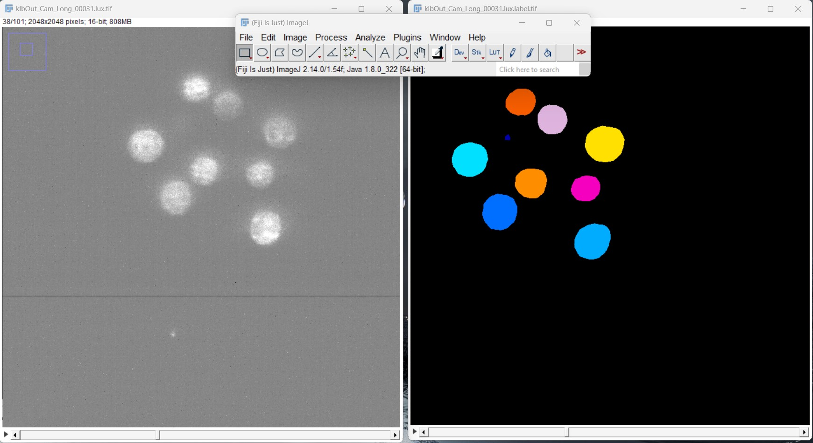
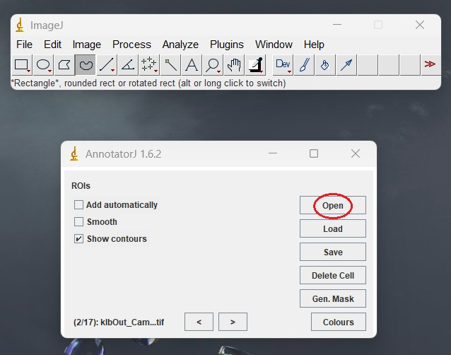
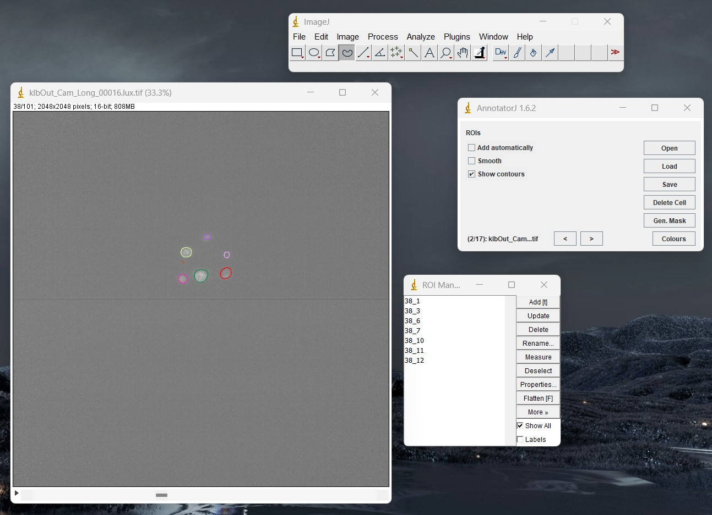
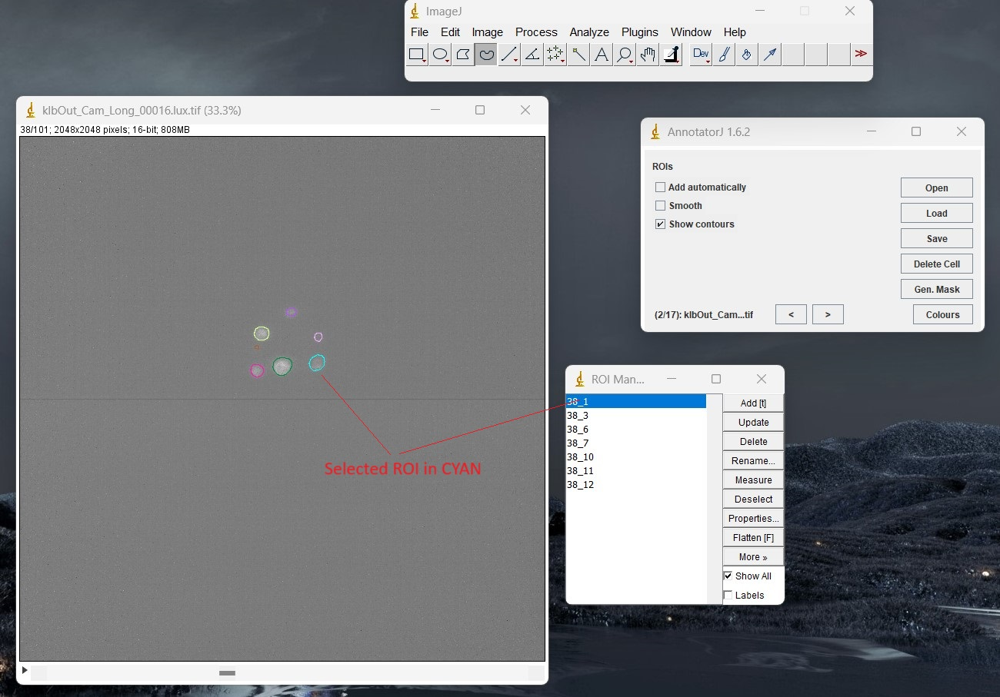
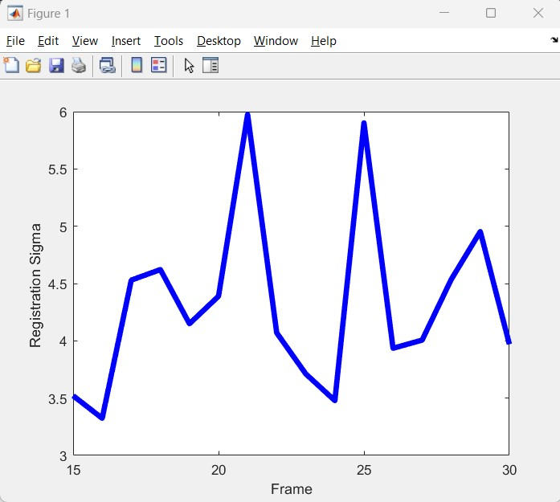
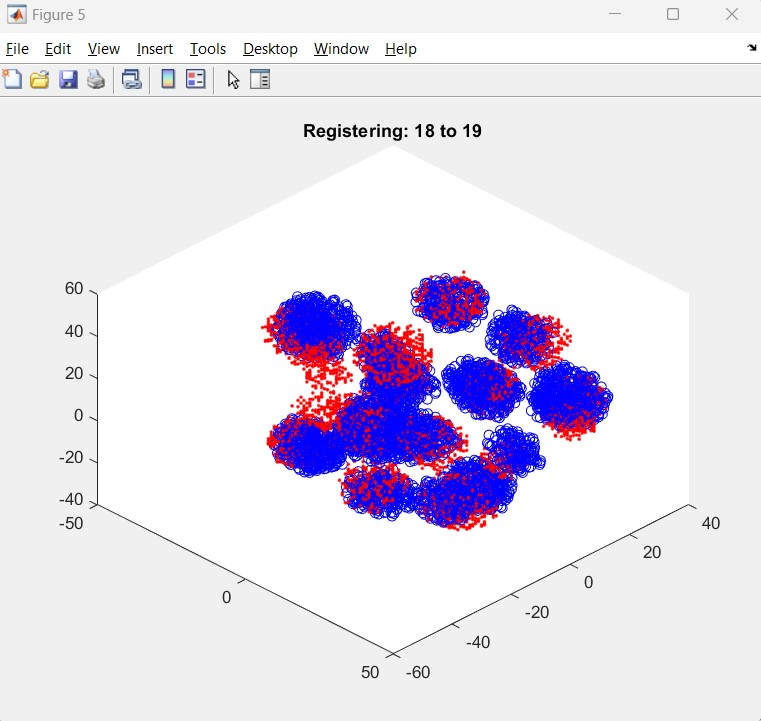
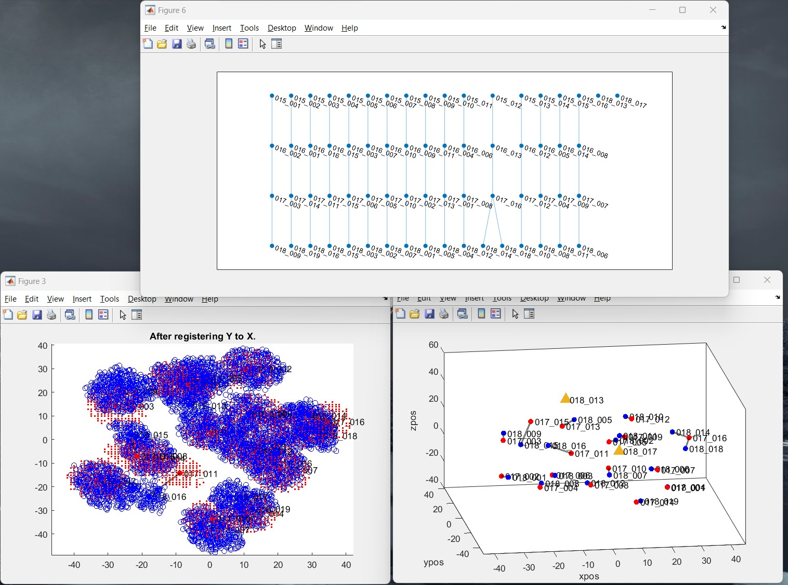

# BLASTOSPIM Instance Segmentation and Tracking Pipeline

## Step 1: Segmentation of Images

### Install the Pipeline

You can run the following commands to install the tool in your own machine.

#### Windows Install

1. Download and install **Python 3.11** version of Miniconda: https://docs.conda.io/en/latest/miniconda.html#windows-installers

2. Open "Command Prompt" and create a conda environment and activate it:
```
CONDA_OVERRIDE_CUDA="11.2" conda create -n tf2-segmentation "tensorflow==2.11.1=cuda112*" --channel conda-forge
conda activate tf2-segmentation
pip install stardist_inference @ git+https://github.com/abiswas-odu/stardist_inference.git
```

### Download and Run Example

#### Download example

To download the example execute the following commands:

```commandline
conda activate tf2-segmentation
pip install blastospim_download @ git+https://github.com/abiswas-odu/blastospim_download.git
cd blastospim_download
mkdir test
cd test 
blastospim_download
```

The commands will create a test directory and download 3 compressed folders and uncompress them in the current folder. The folders are:

1. data : The data files with the following folders:
    - Images : The original images from the microscope in TIF format. The images capture the transition from 8-16 cell stage division. 
    - Expected_Segmentation : The segmentation output that should be produced using the early stage model. 
    - Corrected_Segmentation : The expert corrected segmentation produced using AnnotatorJ.
    - Expected_Track : The config.yaml file and the expected registration transforms and tree.
2. early_embryo_model: The early model to be used for inference if the images have less than 45-50 cells.  
3. late_embryo_model: The late model to be used for inference if the images have greater than 45-50 cells.

##### Run the instance segmentation 

stardist_inference package has a reasonable commandline interface with help. 

```stardist_inference --help```

A sample SLURM script is provided in ```scripts/runInferenceSD.cmd```. Change the parameters on top and use ```sbatch``` to submit.
It may be necessary to load the anaconda/miniconda module if your login does not load it to begin with.

The TIF files produced should be compared with the TIF files in `Expected_Segmentation` for verification. 
Here is an example of the segmentation produced by the model.  



## Step 2: Manual Correction of Labels

The manual correction of labels is performed using a ImageJ plugin tool AnnotatorJ version 1.6. 

#### Create a Correction Directory

Create a directory with the original images and the `stardist_rois` directory in it. 
For the test example, copy the `stardist_rois` generated during Step 1 into the `Images` folder.

#### Install AnnotatorJ 1.6.2 

1. Install JRE version 8 from here: 
2. Download the AnnotatorJ 1.6.2 JAR file from here: https://drive.google.com/file/d/1Tnsy-BcGLwSHmU4rwH-4taSEwHA1RqoF/view?usp=drive_link
3. Change to the directory with the AnnotatorJ 1.6 JAR file and execute the command:
```commandline
java -jar annotator_Project-1.6.2.jar
```
4. This should open the following 2 windows




#### Performing Manual Corrections

1. Click the Open button in the AnnotatorJ 1.6.2 window and navigate to the `Images` folder. 

2. Select the image to be corrected. After the image is loaded, scroll to the frame to be corrected. 




3. The boundary of the segmentation of the cells is shows in different colors. These boundaries are called Region on Interest or *ROI* .
The `ROI Manager` window shows the label IDs and the frame number of each cell. 
The same cell is colored the same across the frames of the 3D image. 

4. ROIs can be selected in the `ROI Manager` window and edited. The selected ROI color changes to cyan as seen below.




5. The `ROI Manager` window and the AnnoratorJ window provide various functions to add, 
rename, delete individual ROIs and whole cells. These can be used to correct any segmentation errors.


## Registration of Labels and Tracking

After the labels generated by the segmentation are corrected the images need to be registered as the embryos rotate randomly. 
The registration and the tracking scripts are written in MATLAB and require a `config.yaml` file to be created to drive the scripts. 

### Download the MATLAB Code

1. Download and install MATLAB.

2. Run the following commands to clone the repository:
```git clone https://github.com/abiswas-odu/lineage_track```

### Create a config.yaml file

Create a folder in your file system and create a config.yaml file which contains paths and setting for
registration and tracking.

There is a sample `config.yaml` file in the `scripts` directory. Copying that as a template will make it easy. 

### Run the Registration

1. Open MATLAB and navigate to the `lineage_track` directory.

2. Open the registration script `lineage_track\registration\Registration_IoU.m`. 

3. Change the `config_path` variable to the folder where you have your `config.yaml`.

4. Run the script. It will produce two files in the output folder `test_transforms.mat` and `test_transforms.json`.
They are the same registration transforms in MATLAB and JSON format respectively.

### Visualize the Registration

On completion the registration, the registered point clouds can be viewed in sequence. 

1. Open the visualization script `lineage_track\registration\VisualizeSequence.m`.

2. Change the `config_path` variable to the folder where you have your `config.yaml`.

3. Run the script. It will produce 2 plots. 
 - A plot of the sigma of the registration for each consecutive timepoint. 


 - A plot showing the point cloud representation of the registration for the first 2 time points in red and blue. 
The blue circles are the point cloud representing the segmented objects at time index `t` and red dots are `t+1`.
Press enter in the MATLAB Command Window to view the next registration. All the consecutive registration can be inspected. 



### Tracking using the Registered Images 

Once the registration transforms are known, the segmented images can be tracked to construct the lineage tree. 

1. Open the tracking script `lineage_track\tree_generation\volume_track_nuclei_divisions.m`.

2. Change the `config_path` variable to the folder where you have your `config.yaml`.

3. Run the script. It will produce 3 plots showing the tracking of the first two time points. 

 - A plot of the registered point clouds for time index `t` and `t+1`.
 - A plot of a lineage tree tracked so far.
 - A plot of the centroid showing the assignment of the cells from `t` to `t+1`. 
Any cells that could not be tracked are shown as a triangle which need to be tracked manually by adding edges in the graph.


It pauses after tracking the cells in the next time point and the user must press enter to proceed 
to the next and 3 more plots will be opened. So, it is recommended to manage the windows being opened by
closing the previous ones. 



